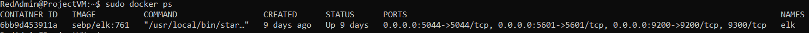

# Week-13-HW
## Automated ELK Stack Deployment

The files in this repository were used to configure the network depicted below.

These files have been tested and used to generate a live ELK deployment on Azure. They can be used to either recreate the entire deployment pictured above. Alternatively, select portions of the playbook files may be used to install only certain pieces of it, such as Filebeat.

  - [Filebeat](Ansible/Filebeat-playbook.yml)
  - [Elk](Ansible/Install-elk.yml)
  - [DWVA](Ansible/DWVA.yml)

This document contains the following details:
- Description of the Topologu
- Access Policies
- ELK Configuration
  - Beats in Use
  - Machines Being Monitored
- How to Use the Ansible Build

### Description of the Topology

The main purpose of this network is to expose a load-balanced and monitored instance of DVWA, the D*mn Vulnerable Web Application.

Load balancing ensures that the application will be highly capable, in addition to restricting traffic to the network.
- Load balancers prevent the use of DDos attacks against an organization. The benifits of a jumpbox machine is to be able to have a more secure machine capable of managing other Virtual machines within our network.

Integrating an ELK server allows users to easily monitor the vulnerable VMs for changes to the logs and system traffic.
- Filebeat watches and monitors log files 
- Metricbeat monitors the metrics of your server through the OS

The configuration details of each machine may be found below.
_Note: Use the [Markdown Table Generator](http://www.tablesgenerator.com/markdown_tables) to add/remove values from the table_.

| Name     | Function       | IP Address | Operating System |
|----------|----------------|------------|------------------|
| Jump Box | Gateway        | 10.0.0.8   | linux            |
| Web 1    | Webserver      | 10.0.0.5   | linux            |
| Web 2    | Webserver      | 10.0.0.6   | linux            |
| Elk      | Elk Monitering | 10.1.0.4   | linux            |

### Access Policies

The machines on the internal network are not exposed to the public Internet. 

Only the Jump Box machine can accept connections from the Internet. Access to this machine is only allowed from the following IP addresses:
- My IP Address, Provided upon request

Machines within the network can only be accessed by the Jump Box.
- My Ansible server has access to the Elk VM, the IP of the Jump Box is 10.0.0.8

A summary of the access policies in place can be found in the table below.

| Name     | Publicly Accessible | Allowed IP Addresses |
|----------|---------------------|----------------------|
| Jump Box | No                  | My Computer          |
| Web 1    | No                  | 10.0.0.8             |
| Web 2    | No                  | 10.0.0.8             |
| Elk      | No                  | 10.0.0.5 / 10.0.0.6  |

### Elk Configuration

Ansible was used to automate configuration of the ELK machine. No configuration was performed manually, which is advantageous because...
- Ansible allows admins to automate tasks instead of having to do all of them manually. This allows said admins to focus on other tasks that can't be automated. 

The playbook implements the following tasks:
- Download Image Map
- Download Docker
- Download Python3
- Download Docker Python Module
- Download Elk and set Published Ports

The following screenshot displays the result of running `docker ps` after successfully configuring the ELK instance.

### Target Machines & Beats
This ELK server is configured to monitor the following machines:
- Web1 10.0.0.5
- Web2 10.0.0.6

We have installed the following Beats on these machines:
- FileBeat will allow us to moniter log files, using these logs we can see changes in the log files, something like the deletion of backups or them being editted can be seen with these logs.

These Beats allow us to collect the following information from each machine:
- _TODO: In 1-2 sentences, explain what kind of data each beat collects, and provide 1 example of what you expect to see. E.g., `Winlogbeat` collects Windows logs, which we use to track user logon events, etc._

### Using the Playbook
In order to use the playbook, you will need to have an Ansible control node already configured. Assuming you have such a control node provisioned: 

SSH into the control node and follow the steps below:
- Copy the ansible.cfg file to /etc/ansible.
- Update the filebeat.cfg file to include the IP addresses of the VMs you want included
- Run the playbook, and navigate to http://20.83.233.193:5601 to check that the installation worked as expected.
